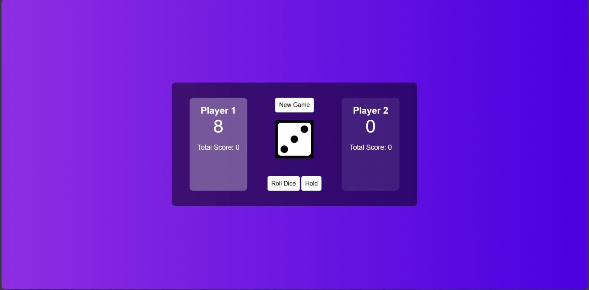

# 🎲 Dice Game

Welcome to the Dice Game! This is a simple yet fun game where players roll dice and compete to get the highest score.

## 🌐 Live Demo

Check out the live version of the game [Dice game](https://zyadelnaghy.github.io/Dice_game/).

## 🚀 Features

- **Two-player mode**: Compete with a friend.
- **Interactive UI**: Enjoy a visually appealing and user-friendly interface.
- **Real-time updates**: See the scores update in real-time as you play.

## 🛠️ Installation

To get started with the Dice Game, follow these steps:

1. **Clone the repository**:
   ```sh
   git clone https://github.com/ZyadElnaghy/Dice_game.git
   cd Dice_game
## 📖 How to Play

1. **Roll the Dice**: Click the "Roll Dice" button to roll the dice.
2. **Hold**: Click the "Hold" button to save your current score and pass the turn to the other player.
3. **Winning**: If a player rolls a 1, the game ends and the player with the highest score wins.
## 🖼️ Screenshots


